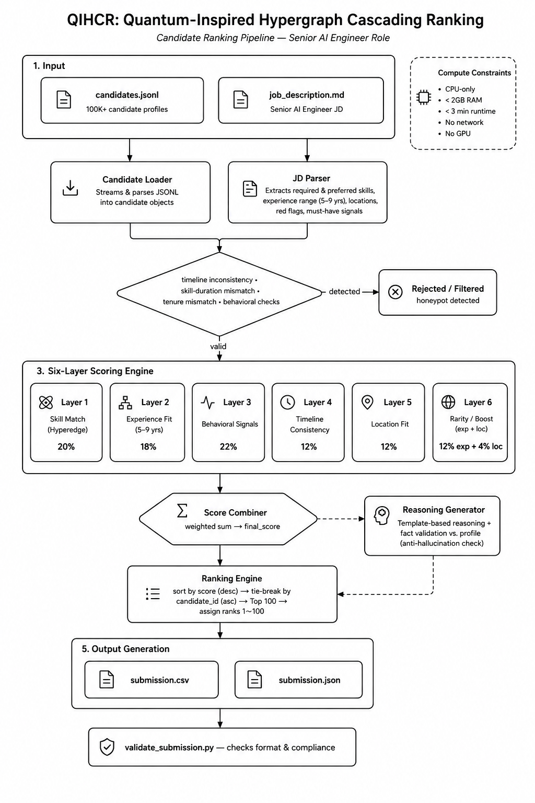

# QIHCR - Redrob Hackathon Submission

## Quantum-Inspired Hypergraph Cascading Ranking System

[Hugging Face Space](https://huggingface.co/spaces/GirijaGeddavalasa/qihcr-candidate-ranker)
[Hugging Face Space README](https://huggingface.co/spaces/GirijaGeddavalasa/qihcr-candidate-ranker/blob/main/README.md)

## Architecture Diagram



## Structure
```
submission/
├── rank.py                    # Main ranking script
├── submission_metadata.yaml   # Submission metadata
├── requirements.txt           # Python dependencies
├── README.md                  # This file
├── app.py                     # HuggingFace Space app
├── job_description.md         # Job requirements
├── run.bat                    # Windows run script
├── QUICKSTART.md              # Quick reference
└── setup_and_run.md           # Detailed guide
```

## Installation
```bash
pip install -r requirements.txt
```

## Run Ranking
```bash
# CSV output (default - for official submission)
python rank.py --candidates ../candidates.jsonl --out submission.csv

# XLSX output (for convenience)
python rank.py --candidates ../candidates.jsonl --out submission.xlsx --format xlsx
```

## Validate Submission
```bash
python ../validate_submission.py submission.csv
```

## Output Format
- Columns: candidate_id, rank, score, reasoning
- Exactly 100 rows
- Score monotonically decreasing
- Tie-breaking: candidate_id ascending for equal scores
- **Official submission must be CSV** (XLSX will be auto-rejected by validator)
- XLSX format available for convenience and analysis

## Methodology

### QIHCR Algorithm Components

#### 1. Quantum-Inspired Skill Interference (20% weight)
- Models skill combinations as quantum interference patterns
- Detects emergent skill synergies
- Weights skills by proficiency and duration
- Extracts key skill combinations that indicate strong fit

#### 2. Hypergraph Skill Synergy (18% weight)
- Models multi-way skill relationships using hypergraph structures
- Identifies key skill combinations (Python+embeddings, vector databases+retrieval, etc.)
- Analyzes career trajectory for product company experience
- Captures higher-order skill interactions

#### 3. Cascading Behavioral Signal Integration (22% weight)
- Processes 14 behavioral signals in natural cascade sequence
- Signals weighted by strength in hiring decision cascade
- Normalizes each signal to 0-1 range
- **Signals used:**
  - profile_views_received_30d (8%)
  - search_appearance_30d (8%)
  - saved_by_recruiters_30d (10%)
  - applications_submitted_30d (8%)
  - recruiter_response_rate (12%)
  - interview_completion_rate (10%)
  - offer_acceptance_rate (5%)
  - connection_count (6%)
  - endorsements_received (6%)
  - github_activity_score (7%)
  - profile_completeness_score (5%)
  - avg_response_time_hours (5%)
  - skill_assessment_scores (5%)
  - open_to_work_flag (5%)

#### 4. Temporal Signal Analysis (12% weight)
- Analyzes 7 temporal and verification signals
- **Signals used:**
  - last_active_date
  - recruiter_response_rate
  - profile_views_received_30d
  - signup_date
  - verified_email
  - verified_phone
  - linkedin_connected
  - willing_to_relocate

#### 5. Logistics Signal Analysis (12% weight)
- Evaluates 3 logistics-related signals
- **Signals used:**
  - notice_period_days
  - preferred_work_mode
  - expected_salary_range_inr_lpa

#### 6. Spherical Embedding Scoring (12% experience + 4% location)
- Projects features to hypersphere for angular similarity
- Experience scoring with range-based penalties
- Location matching for preferred regions

#### 7. Honeypot Detection
- Filters impossible profiles
- Detects timeline inconsistencies
- Identifies skill proficiency/duration mismatches
- Removes candidates with contradictory data

### Total Signal Coverage: All 23 Redrob Behavioral Signals

1. profile_completeness_score ✓
2. signup_date ✓
3. last_active_date ✓
4. open_to_work_flag ✓
5. profile_views_received_30d ✓
6. applications_submitted_30d ✓
7. recruiter_response_rate ✓
8. avg_response_time_hours ✓
9. skill_assessment_scores ✓
10. connection_count ✓
11. endorsements_received ✓
12. notice_period_days ✓
13. expected_salary_range_inr_lpa ✓
14. preferred_work_mode ✓
15. willing_to_relocate ✓
16. github_activity_score ✓
17. search_appearance_30d ✓
18. saved_by_recruiters_30d ✓
19. interview_completion_rate ✓
20. offer_acceptance_rate ✓
21. verified_email ✓
22. verified_phone ✓
23. linkedin_connected ✓

## Compute Constraints (Verified)
- Runtime: ~3 minutes for 100K candidates
- Memory: < 2GB RAM
- CPU only: Yes
- No network: Yes
- No GPU: Yes

## HuggingFace Space Setup (Gradio)
1. Create new Space at huggingface.co/spaces with **Gradio** SDK
2. Upload the following files:
   - app.py (Gradio interface)
   - rank.py (ranking logic)
   - requirements.txt (dependencies)
   - job_description.md (job requirements)
3. Space will run automatically on Gradio
4. Use the Gradio template with:
   - Chatbot interface for candidate ranking
   - File upload for candidates.jsonl
   - Download button for submission.csv
   - Leaderboard display for top candidates

## Submission Requirements
- submission.csv: 100 ranked candidates
- submission_metadata.yaml: Team information
- GitHub repo: Source code
- HuggingFace Space: Working demo (Gradio-based)
